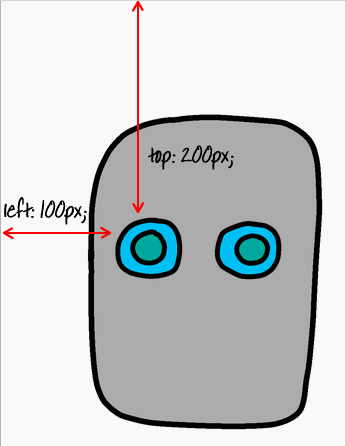

## أعطي روبوتك عيون

لنعطي روبوتك بعض العيون!

+ لنفتح هذا القوس {:target="_blank"}.
    
    يجب ان يبدو الملف مثل هذا:
    
    

كل صوره في المشروع تملك اسماً خاصاً (او id). For example, the HTML code to address the face and eye images (‘face’, ‘eyes1’, and ‘eyes2’, starting on line 8 of your code) looks like this:

    
    
    
    

You can use an image’s `id` to give it its own style, using CSS and the `#` symbol. This allows you to style each image separately.

Click on the `style.css` file. Notice how the size of the robot’s face and the other images are different?

+ Add this CSS code to style the robot’s eyes:
    
        #eyes1 {
        width: 200px;
        }
        

Notice that you’re styling just the `eyes1` image, by using `#eyes1` in your CSS code. If you prefer different eyes, you can use `#eyes2` or `#eyes3` instead!

Notice how each image is displayed one after the other? This is called **relative** positioning. If you want to tell the browser exactly where to place your robot’s eyes, you’ll need to use **absolute** positioning instead.

+ Add these three lines to the CSS code for your `eyes1` image:
    
        position: absolute;
        top: 200px;
        left: 100px;
        

You should see that your robot’s eyes move to the correct place on your robot.

This CSS code tells the browser how far from the top left-hand corner of the webpage to display the image.

You can use `bottom` instead of `top` to tell the browser how far from the bottom of the screen to show the image, as well as `right` instead of `left`.