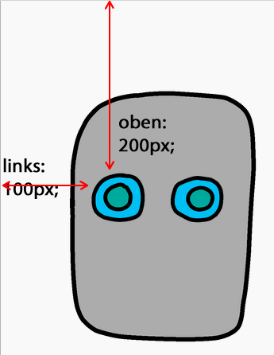

## Gib deinem Roboter Augen

Lass uns deinem Roboter Augen geben!

+ Öffne dieses [trinket](http://jumpto.cc/web-robot){:target="_blank"}.
    
    Das Projekt sollte so aussehen:
    
    

Jedes Bild in diesem Projekt hat seinen eigenen Namen (oder **`id`**). Der HTML-Code zum Nutzen der Gesichts- und Augenbilder ("Face", "Eyes1" und "Eyes2" ab Zeile 8 im Programm) sieht zum Beispiel so aus:
```
    
    
    
```    

Du kannst die `id` eines Bildes verwenden, um ihm einen eigenen Stil zu geben. Dazu nutzt du CSS und das Rautensymbol `#` Symbol. So kannst du das Aussehen jedes Bildes individuell gestalten.

Klicke auf die `style.css` Datei. Siehst du, wie unterschiedlich die Größe von Gesicht oben und den Gesichtselementen unten ist, weil wir verschiedene Breiten (hier: width) im Programm genutzt haben?


+ Füge diesen CSS-Code hinzu, um die Augen des Roboters zu stylen:
```   
        #eyes1 {
        width: 200px;
        }
```        

Beachte, dass du nur das Bild `eyes1` veränderst, in dem du es mit `#eyes1` auswählst und mit dem width Parameter veränderst. Wenn du andere Augen verändert möchtest, wähle stattdessen `#eyes2` oder `#eyes3`!


Fällt dir auf, wie jedes Bild eines nach dem anderen angezeigt wird? Dies wird **relative** Positionierung genannt. Wenn du dem Browser genau sagen wollen, wo er die Augen deines Roboters platzieren soll, musst du stattdessen **absolute** Positionierung verwenden.

+ Füge dem CSS Code diese drei Zeilen für deine `eyes1` Bild hinzu:
```    
        position: absolute;
        top: 200px;
        left: 100px;
```        

Stelle sicher, dass sich die Augen deines Roboters an der richtige Stelle befinden.


Dieser CSS-Code teilt dem Browser mit, wie weit entfernt von der oberen linken Ecke der Webseite das Bild angezeigt werden soll.



Du kannst `bottom` anstelle von `top` verwenden, um dem Browser zu sagen, wie weit vom unteren anstelle vom oberen Bildschirmrand das Bild entfernt sein soll. Ähnlich kannst du `right` anstelle von `left` wählen, um den Bezugspunkt von links nach rechts zu verlegen.