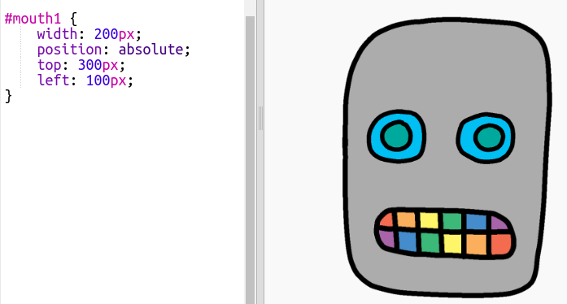

## Gib deinem Roboter einen Mund

Lass uns deinem Roboter einen Mund geben!

- Füge den folgenden CSS-Code am Ende des `style.css` Tags hinzu, um dein `mouth1` Bild zu positionieren:
    
        #mouth1 {
            width: 50px;
            position: absolute;
            top: 200px;
            left: 200px;
        }
        

Der Mund deines Roboters ist zu klein, und er ist nicht am richtigen Ort!

- Kannst du das beheben, indem du deinem CSS-Code änderst?

\--- hints \---

\--- hint \---

You'll need to change the `width` and the `top` and `left` positions for `mouth1` in `style.css`.

Try different values until it looks the way you want.

\--- /hint \---

\--- hint \---

You should have something like this:

\--- /hint \---

\--- /hints \---