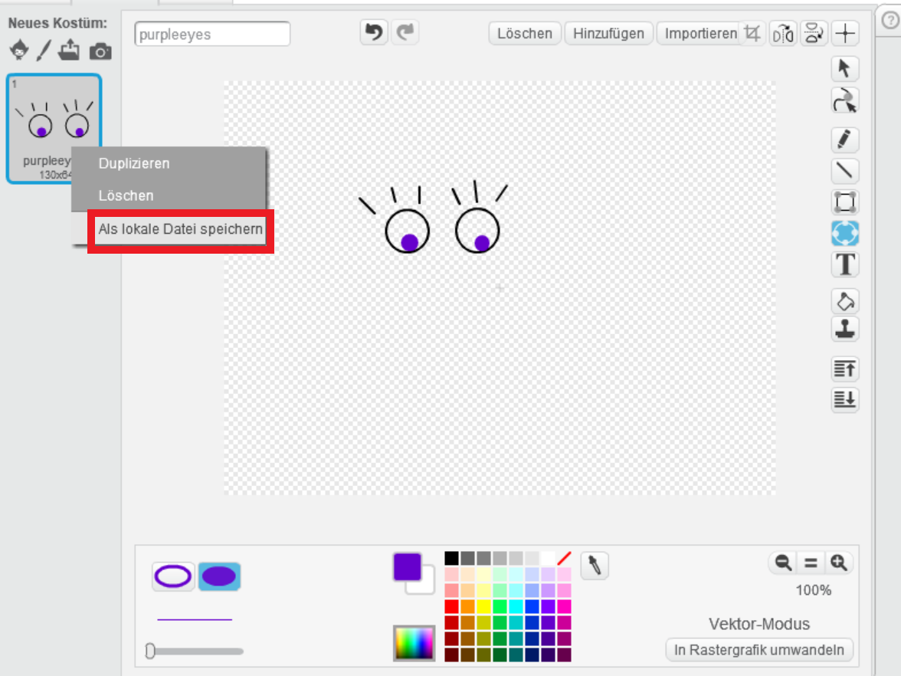

--- challenge ---

## Aufgabe: Füge ein eigenes Bilder hinzu

Kannst du Bilder erstellen, die du zu deinem Roboter hinzufügst und auf deiner Webseite positionierst?

+ Wenn du kein Zeichenprogramm hast, kannst du neue Roboterteile mit dem Scratch-Malwerkzeug im **Bitmap** Modus zeichnen. Verwende **als lokale Datei speichern**, um ein Kostüm als `png` Bild zu speichern. Zum Speichern klicke mit der rechten Maustaste auf das zu speichernde Kostüm in der Kostümübersicht.
    
    

+ Dann lade die `.png` Datei hoch in dein Trinket:
    
    

+ Füge das Bild zu `index.html` hinzu:
    
        

+ Und füge CSS-Code zu `style.css` hinzu, um es zu positionieren.
    
    

--- /challenge ---
