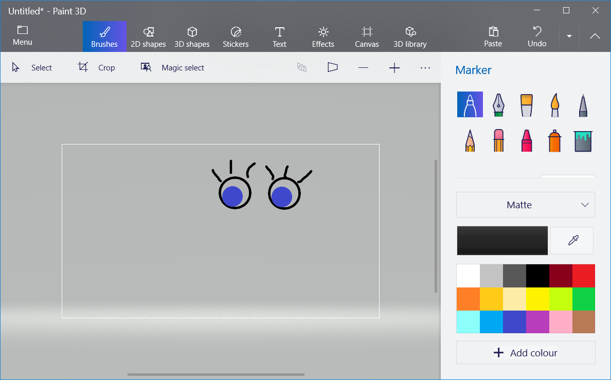

--- challenge ---

## Πρόκληση: πρόσθεσε δικές σου εικόνες

Μπορείς να δημιουργήσεις εικόνες για να τις προσθέσεις στο ρομπότ σου και να τις τοποθετήσεις στην ιστοσελίδα σου;

Χρησιμοποίησε οποιοδήποτε λογισμικό σχεδίασης έχεις στον υπολογιστή σου για να σχεδιάσεις μερικά νέα εξαρτήματα ρομπότ και αποθήκευσέ το ως `.png` εικόνα.

+ Στη συνέχεια, ανέβασε την εικόνα `.png` στο trinket σου:

+ Πρόσθεσε την εικόνα στο `index.html`: 

    
    

+ Και πρόσθεσε τον κώδικα CSS στο αρχείο `style.css` για να την τοποθετήσεις:

--- /challenge ---

**Κοινοτική συνεισφορά μετάφρασης**

Το έργο αυτό μεταφράστηκε από **Γιώργος Νικολαΐδης**/**Μάνος Ζεάκης** και αναθεωρήθηκε από **Κυριακή Ιντζεΐδου**.

Οι εκπληκτικοί μας εθελοντές-μεταφραστές μας βοηθούν να δώσουμε στα παιδιά όλου του κόσμου την ευκαιρία να μάθουν να προγραμματίζουν. Μπορείτε να μας βοηθήσετε να προσεγγίσουμε περισσότερα παιδιά μεταφράζοντας τα έργα μας - διαβάστε περισσότερα στο [rpf.io/translate](https://rpf.io/translate).