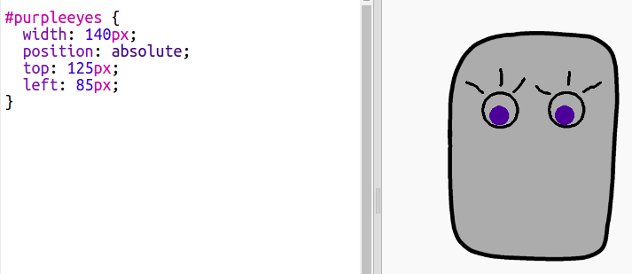

--- challenge ---
## Challenge: Add your own images
Can you find extra images to add to your robot, and position them on your webpage? 

```

```

Why not create your own robot parts? You could use the Windows Paint tool or another drawing program. Export your robot parts as '.gif' or '.png' files with sensible names and then add the images to trinket. 


If you don't have a drawing tool then you could use the paint tool in Scratch in Bitmap mode to draw some new robot parts. Use 'save as local file' to save costumes as '.png' images ...


... and upload and use them into your project.



--- /challenge ---