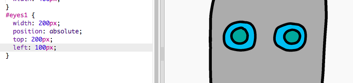

## Dándole ojos a tu robot

¡Vamos a darle ojos a tu robot!

+ Abre [this trinket](http://jumpto.cc/web-robot){:target="_blank"}.
    
    El proyecto debe verse así:
    
    

Cada imagen en este proyecto tiene su proprio nombre (or **`id`**). Por ejemplo, el código HTML para dirigirse a las imágenes de la cara y los ojos (‘face’, ‘eyes1’, y ‘eyes2’, a partir de la línea 8 de tu código) se parece a esto:
```
    
    
    
```    

Puedes usar el `id` de una imagen para darle su propio estilo, usando CSS y el símbolo `#`. Esto te permite diseñar cada imagen por separado.

Haga clic en el archivo `style.css`. ¿Observas cómo el tamaño de la cara del robot y las otras imágenes son diferentes?


+ Agrega este código CSS para diseñar los ojos del robot:
    ```
        #eyes1 {
        width: 200px;
        }
    ```    

Ten en cuenta que estás diseñando solo la imagen `eyes1`, usando `#eyes1` en tu código CSS. ¡Si prefieres ojos diferentes, puedes usar `#eyes2` o `#eyes3` en su lugar!


¿Observas cómo las imágenes se muestran una tras otra? Esto se llama posicionamiento **relative**. Si quieres decirle al navegador exactamente dónde colocar los ojos de tu robot, necesitarás usar posicionamiento **absolute** en su lugar.

+ Agrega estas tres líneas al código CSS para tu imagen `eyes1`:
    ```
        position: absolute;
        top: 200px;
        left: 100px;
    ```    

Deberías ver que los ojos de tu robot se mueven al lugar correcto en tu robot.



Este código CSS indica al navegador cuán lejos de la esquina superior izquierda de la página web debe aparecer la imagen.


Puedes usar `bottom` en lugar de `top` para indicar al navegador cuán lejos de la parte inferior de la pantalla debe aparecer la imagen, así como `right` en lugar de `left`.