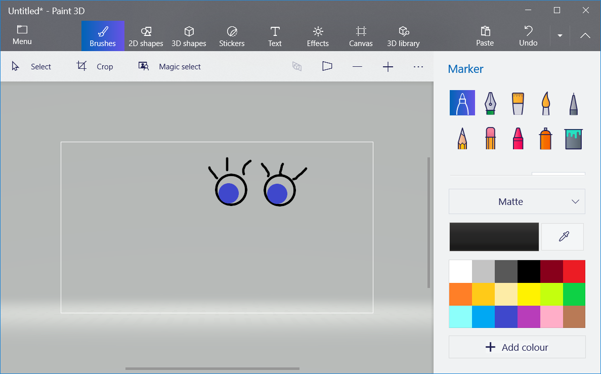

\--- challenge \---

## Challenge: add your own images

Can you create images to add to your robot, and position them on your webpage?

Use whatever drawing software you have on your computer to draw some new robot parts, and save it as a `.png` image.

+ Then upload the `.png` image into your trinket:

+ Add the image to `index.html`: 

    
    

+ And add CSS code to `style.css` to position it:

\--- /challenge \---