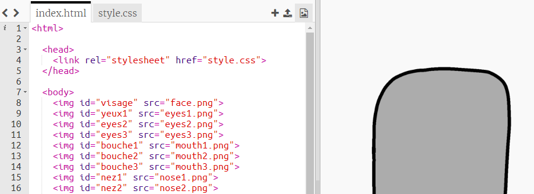
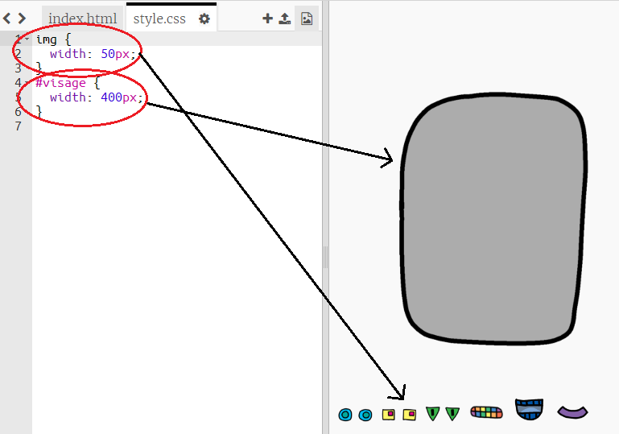
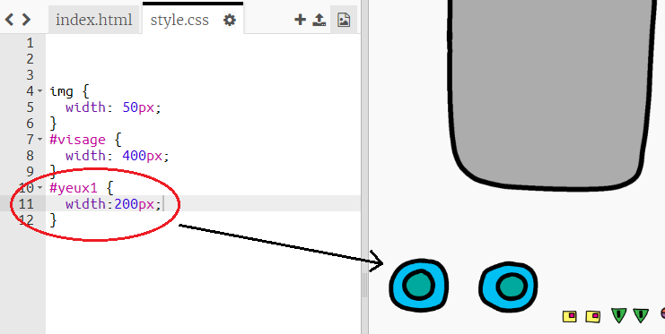
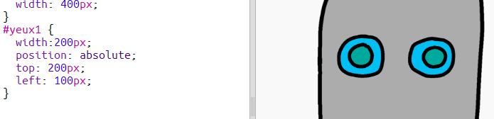

## Donner des yeux à ton robot

Donnons des yeux à ton robot !

+ Open [this trinket](http://jumpto.cc/web-robot){:target="_blank"}.
    
    Le projet devrait ressembler à ceci:
    
    

Chaque image dans le projet a son propre nom (ou **`id`**). Par exemple, le code HTML pour traiter le visage et les images des yeux ('visage', 'yeux1' et 'yeux2', à partir de la ligne 8 de ton code) ressemble à ceci:

    
    
    
    

Tu peux utiliser l'`id` des images pour leur donner leur propre style, en utilisant du CSS grâce au symbole `#`. Cela te permet à changer le style de chaque image séparément.

Clique sur le fichier `style.css`. As-tu remarqué comment la taille du visage du robot et des autres images sont différentes ?

+ Ajoute ce code CSS pour modifier le style des yeux du robot :
    
        #yeux1 {
        width: 200px;
        }
        

Garde a l'esprit que tu ne modifies que l'apparence de l'image `yeux1` en utilisant `#yeux1` dans ton code CSS. Si tu préfères des yeux différents, tu peux utiliser `#yeux2` ou `yeux3` !

As-tu remarqué comment chaque image s'affiche l'une après l'autre ? Ceci s'appelle positionnement **relatif**. Si tu veux dire au navigateur où placer exactement les yeux de ton robot, tu devras utiliser le positionnement **absolue** à sa place.

+ Ajoute ces trois lignes à ton code CSS pour ton image `yeux1` :
    
        position: absolute;
        top: 200px;
        left: 100px;
        

Tu devrais voir que les yeux de ton robot se placent au bon endroit sur ton robot.

Ce code CSS indique au navigateur à quelle distance du coin supérieur gauche de la page l'image doit s'afficher.

Tu peux utiliser `bottom` au lieu de `top` pour indiquer au navigateur à quelle distance du bas de l'écran l'image doit s'afficher, ainsi que `right` au lieu de `left`.