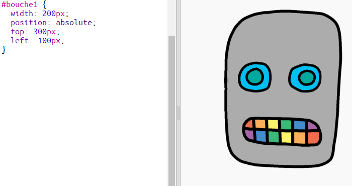

## Donner une bouche à ton robot

Donnons une bouche à ton robot !

- Ajoute le code CSS suivant à la fin du fichier `style.css` pour modifier le style de ton image `bouche1`:
    
        #bouche1 {
            width: 50px;
            position: absolute;
            top: 200px;
            left: 200px;
        }
        

La bouche de ton robot a l'air assez petite, et elle n'est pas au bon endroit !

- Peux-tu la corriger en faisant ton propre code CSS ?

\--- hints \---

\--- hint \---

You'll need to change the `width` and the `top` and `left` positions for `mouth1` in `style.css`.

Try different values until it looks the way you want.

\--- /hint \---

\--- hint \---

You should have something like this:

\--- /hint \---

\--- /hints \---