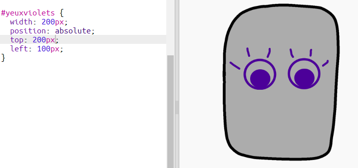

--- challenge ---

## Défi: ajoute tes propres images

Peux-tu créer des images ajouter à ton robot et les positionner sur ton siteweb ?

+ Si tu n'as pas de logiciel de dessin, tu peux utiliser l'outil de dessin de Scratch en mode **Bitmap** pour dessiner quelques nouveaux éléments du robot. Utilise **enregistrer localement comme fichier** pour sauvegarder un costume comme une image `.png`.
    
    

+ Ensuite, télécharge l'image `.png` dans ton trinket:
    
    

+ Ajoute l'image au fichier `index.html`:
    
        
        

+ Et ajoute du code CSS à `style.css` pour la positionner:
    
    

--- /challenge ---

***
Ce projet a été traduit par des bénévoles:

**Simon Gleises**

**Sarah-Jane Hubbard**

Grâce aux bénévoles, nous pouvons donner aux gens du monde entier la chance d'apprendre dans leur propre langue. Vous pouvez nous aider à atteindre plus de personnes en vous portant volontaire pour la traduction - plus d'informations sur [rpf.io/translate](https://rpf.io/translate).