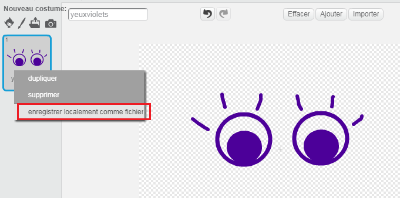

\--- challenge \---

## Défi: ajoute tes propres images

Peux-tu créer des images à ajouter à ton robot et les positionner sur ta page web ?

+ Si tu n'as pas de logiciel de dessin, tu peux utiliser l'outil de dessin de Scratch en mode **Bitmap** pour dessiner quelques pièces de robot. Utilise **enregistrer localement comme fichier** pour sauvegarder un costume comme une image `.png`.
    
    

+ Ensuite, télécharge l'image `.png` dans ton trinket:
    
    

+ Ajoute l'image au fichier `index.html`:
    
        
        

+ And add CSS code to `style.css` to position it:
    
    

\--- /challenge \---