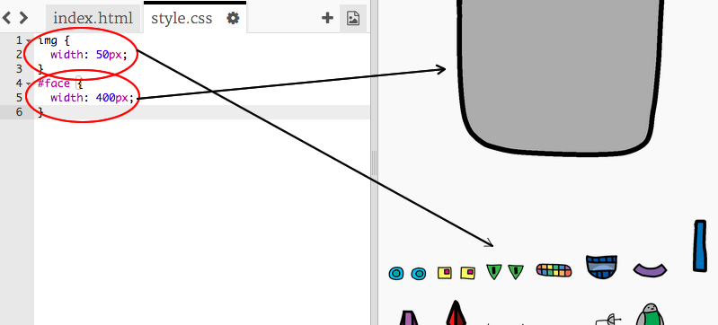

## अपने रोबोट की आँखें बनाना

चलिए आपके रोबोट की आँखें बनाएँ!

+ [इस trinket](http://jumpto.cc/web-robot){:target="_blank"} को खोलें।
    
    परियोजना इस तरह दिखनी चाहिए:
    
    

इस परियोजना में प्रत्येक छवि का अपना खुद​ का नाम (या **`id`** है)। उदाहरण के लिए, चेहरे और आंखों की छवियों को संबोधित करने के लिए HTML कोड ('face', 'eyes 1', और 'eyes 2', आपके कोड की लाइन 8 के शुरुआत मे) इस तरह दिखता है:
```
    
    
    
```    

आप एक छवि के `id` का उपयोग कर सकते हैं इसे अपना खुद​ का स्टाइल देने के लिए, CSS और `#` प्रतीक का उपयोग करके। यह आपको प्रत्येक छवि को अलग से स्टाइल करने की अनुमति देता है।

`style.css` फ़ाइल पर क्लिक करें। ध्यान दें कि रोबोट के चेहरे का आकार और अन्य छवियों का अकार कैसे भिन्न हैं?



+ रोबोट की आँखों को स्टाइल करने के लिए इस CSS कोड को जोड़ें:
```    
        #eyes1 {
        width: 200px;
        }
```        

ध्यान दें कि आप सिर्फ `eyes1` छवि को स्टाइल कर रहे हैं, `#eyes1` का उपयोग करके अपने CSS कोड में। यदि आप अलग आँखें पसंद करते हैं, तो आप इसके बजाय `#eyes2` या `#eyes3` का उपयोग कर सकते हैं!


ध्यान दें कि प्रत्येक छवि एक के बाद एक कैसे प्रदर्शित होती है? इसे **relative** पोजिशनिंग कहा जाता है। यदि आप ब्राउज़र को बताना चाहते हैं कि सही से आपके रोबोट की आँखें कहाँ रखनी हैं, तो आपको इसके बजाय **absolute** पोजिशनिंग का उपयोग करना होगा।

+ CSS कोड में इन तीन पंक्तियों को जोड़ें अपने `eyes1` छवि के लिए:
```    
        position: absolute;
        top: 200px;
        left: 100px;
```        

आपको यह देखना चाहिए कि आपके रोबोट की आँखें आपके रोबोट पर सही जगह पर जाएँ।


यह CSS कोड ब्राउज़र को बताता है कि वेब पृष्ठ के ऊपरी बाएं कोने से कितनी दूर छवि को प्रदर्शित करना है।


आप `bottom` का उपयोग कर सकते हैं `top` के बजाय ब्राउज़र को यह बताने के लिए स्क्रीन के नीचे से कितनी दूर छवि को दिखाना है, साथ ही `right` के बजाय `left`।