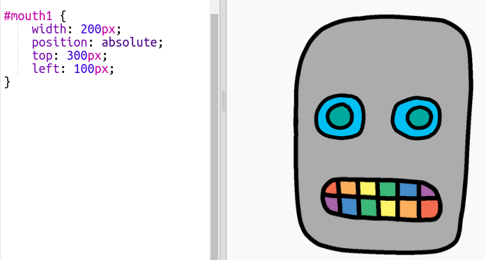

## अपने रोबोट का मुँह बनाना

चलिए आपके रोबोट का मुँह बनाएँ!

- `style.css` के नीचे निम्नलिखित CSS कोड जोड़ें अपनी `mouth1` छवि को स्टाइल करने के लिए:
    
        #mouth1 {
            width: 50px;
            position: absolute;
            top: 200px;
            left: 200px;
        }
        

आपके रोबोट का मुँह काफी छोटा दिख रहा है, और यह सही जगह पर नहीं है!

- क्या आप अपने CSS कोड में बदलाव करके इसे ठीक कर सकते हैं?

\--- hints \---

\--- hint \---

आपको `width` और `top` और `left` स्थान को `mouth1` के लिए बदलने की जरुरत होगी `style.css` मे।

तब तक​ विभिन्न मूल्यों को आजमाएँ जब तक आप जैसा चाहते हैं ये वैसा न दिखे।

\--- /hint \---

\--- hint \---

आपके पास ऐसा कुछ होना चाहिए:

\--- /hint \---

\--- /hints \---