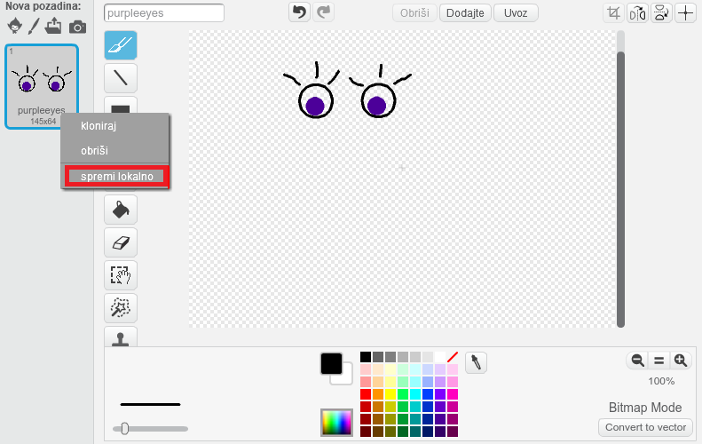

\--- challenge \---

## Izazov: Dodajte svoje vlastite slike

Možete li izraditi slike koje želite dodati robotu i postaviti ih na svoju web stranicu?

+ Ako nemate alat za crtanje, možete upotrijebiti alat Scratch Paint u **Bitmap** način privlačenja novih dijelova robota. Koristite **save as local file** za spremanje kostima kao `.png` slika.
    
    

+ Zatim prenesite `.png` sliku u svoj nakit:
    
    

+ Dodajte sliku u `index.html`:
    
        
        

+ Dodajte CSS kôd u `style.css` da ga postavite:
    
    

\--- /challenge \---