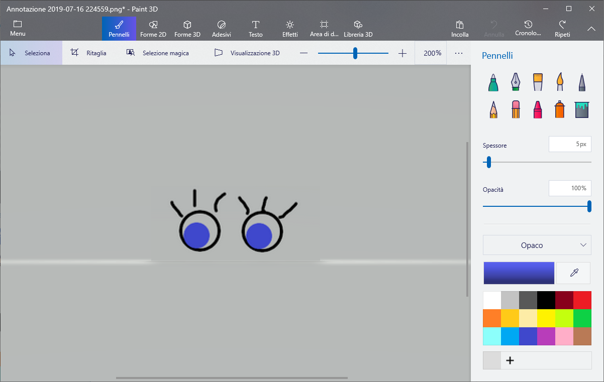

\--- challenge \---

## Sfida: aggiungi le tue immagini

Riesci a creare immagini da aggiungere al tuo robot e posizionarle sulla tua pagina web?

Usa qualsiasi software sul tuo computer per disegnare nuove parti del robot e salvarle come un'immagine `.png`.

+ Quindi carica l'immagine `.png ` nel tuo trinket:

+ Aggiungi l'immagine a ` index.html `: 

    
    

+ E aggiungi il codice CSS a ` style.css ` per posizionarlo:

\--- /challenge \---