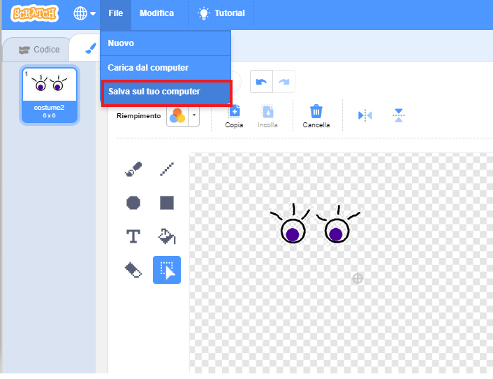

\--- challenge \---

## Challenge: add your own images

Can you create images to add to your robot, and position them on your webpage?

+ Se non si dispone di uno strumento software di disegno, è possibile utilizzare lo strumento di pittura Scratch in ** Bitmap ** modalità per disegnare alcune nuove parti del robot. Use **save as local file** to save a costume as a `.png` image.
    
    

+ Then upload the `.png` image into your trinket:
    
    

+ Add the image to `index.html`:
    
        
        

+ And add CSS code to `style.css` to position it:
    
    

\--- /challenge \---