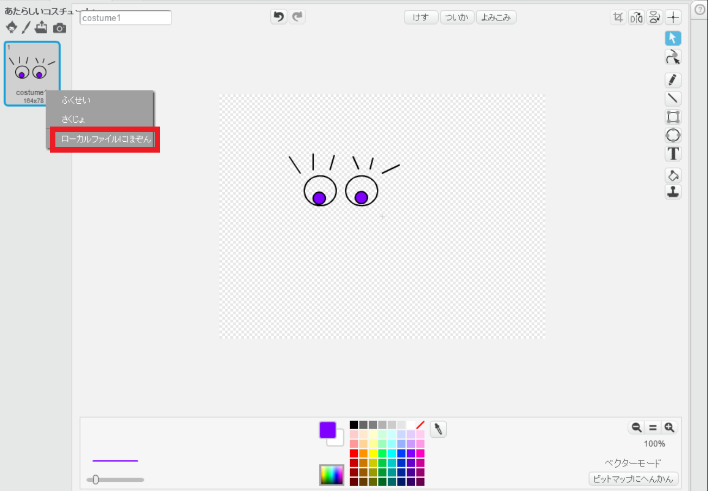

--- challenge ---

## チャレンジ：画像を追加します。

ロボットに加えるイメージを作成し、またウェブページに配置できますか?

+ もし描画ツールを持っていなければスクラッチのペイントツールを使ってBitmapモードでなにか新しいロボットのパーツを作画してもいいです。 **ローカルファイルとして保存**を使って`.png`イメージとしてコスチュームを保存します。
    
    

+ そして`.png`イメージをあなたのtrinketにアップロードします。
    
    

+ そのイメージを`index.html`に加えます。
    
        
        

+ そして、位置決めするためにCSSコードを`style.css`に加えます。
    
    

--- /challenge ---
