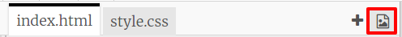
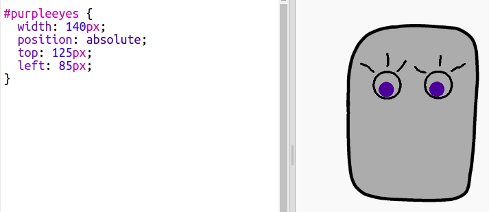

--- challenge ---

## 도전 과제: 나만의 이미지 추가하기

로봇에 추가할 이미지를 만들고, 웹 페이지에 배치해 볼까요?

원하는 그림 소프트웨어를 사용하여 로봇의 부품을 그린 후, `.png` 이미지로 저장하세요.

+ 저장한 `.png` 이미지를 trinket에 업로드해주세요.

+ 업로드한 이미지를 `index.html`에 추가해주세요. 

    
    

+ 이제 `style.css` 파일에 CSS 코드를 추가하여 새 부품의 위치를 잡아 봅시다.

--- /challenge ---