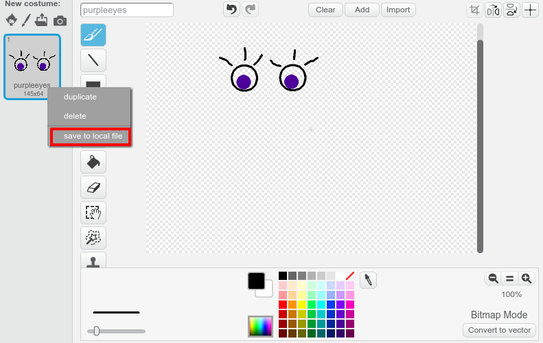

\--- challenge \---

## Challenge: 도전 과제 - 나만의 이미지 추가하기

로봇에 추가할 이미지를 만들고, 웹 페이지에 배치해 볼까요?

+ 만약 그림을 그릴 소프트웨어가 없는 경우, 스크래치 페인트 도구의 **Bitmap** 모드로 나만의 로봇 부품을 그릴 수 있습니다. 이미지를 저장할 때는 **로컬 파일로 저장**을 사용하여 `.png` 파일로 저장합시다.
    
    

+ 저장한 `.png` 이미지를 당신의 trinket에 업로드해 주십시오.
    
    

+ 업로드한 이미지를 `index.html`에 추가해 주십시오.
    
        
        

+ And add CSS code to `style.css` to position it:
    
    

\--- /challenge \---