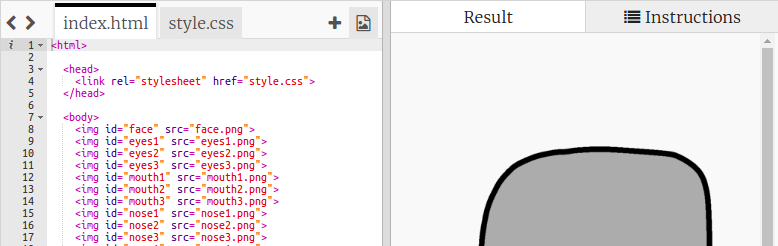

## Dodavanje očiju

Dodajmo tvom robotu oči!

+ Otvori [ovaj trinket](http://jumpto.cc/web-robot).
    
    Projekat treba da izgleda ovako:
    
    

Svaka slika u ovom projektu ima svoj naziv (ili **`id`**). Na primjer, HTML kôd za slike lica i očiju ('face', 'eyes1' i 'eyes2', koji počinje u 8. redu tvog kôda) izgleda ovako:

    
    
    
    

Možeš koristiti `id` slike da joj dodijeliš njen sopstveni stil, koristeći CSS i znak `#`. Ovo ti omogućava da svaku sliku posebno stilizuješ.

Klikni na datoteku `style.css`. Primjećuješ li da postoji razlika u veličini robotovog lica i ostalih slika?

+ Dodaj ovaj CSS kôd kojim ćeš stilizovati robotove oči:
    
        #eyes1 {
        width: 200px;
        }
        

Notice that you’re styling just the `eyes1` image, by using `#eyes1` in your CSS code. If you prefer different eyes, you can use `#eyes2` or `#eyes3` instead!

Notice how each image is displayed one after the other? This is called **relative** positioning. If you want to tell the browser exactly where to place your robot’s eyes, you’ll need to use **absolute** positioning instead.

+ Add these three lines to the CSS code for your `eyes1` image:
    
        position: absolute;
        top: 200px;
        left: 100px;
        

You should see that your robot’s eyes move to the correct place on your robot.

This CSS code tells the browser how far from the top left-hand corner of the webpage to display the image.

You can use `bottom` instead of `top` to tell the browser how far from the bottom of the screen to show the image, as well as `right` instead of `left`.