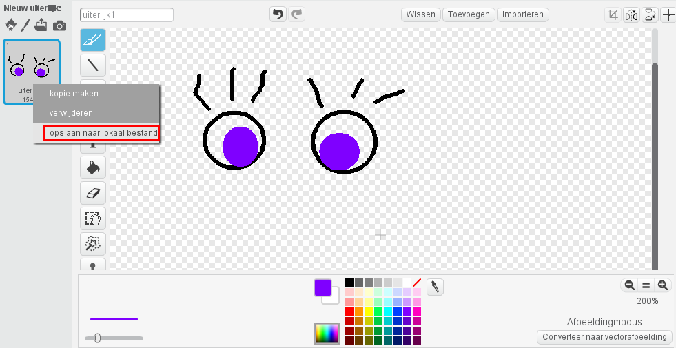

--- challenge ---

## Uitdaging: voeg je eigen afbeeldingen toe

Kun je afbeeldingen maken die je aan je robot toevoegt en ze op je webpagina plaatsen?

+ Als je geen tekenprogramma hebt kun je in Scratch tekenen, in de **Afbeeldingsmodus**. Kies voor **opslaan naar lokaal bestand** om de afbeelding op te slaan als `.png` afbeelding.
    
    

+ Upload dan de `.png` -afbeelding naar je trinket:
    
    

+ Voeg de afbeelding toe aan `index.html`:
    
        
        

+ En voeg CSS-code toe aan `style.css` om het op zijn plek te zetten:
    
    

--- /challenge ---

***
Dit project werd vertaald door vrijwilligers:

**Henny van Ham**

**Cor Groot**

Dankzij vrijwilligers kunnen we mensen over de hele wereld de kans geven om in hun eigen taal te leren. Jij kunt ons helpen meer mensen te bereiken door vrijwillig te starten met vertalen - meer informatie op [rpf.io/translate](https://rpf.io/translate).