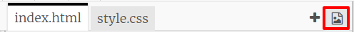

\--- challenge \---

## Uitdaging: voeg je eigen afbeeldingen toe

Kun je afbeeldingen maken die je aan je robot toevoegt en ze op je webpagina plaatsen?

Use whatever drawing software you have on your computer to draw some new robot parts, and save it as a `.png` image.

+ Upload dan de `.png` -afbeelding naar je trinket:

+ Voeg de afbeelding toe aan `index.html`: 

    
    

+ En voeg CSS-code toe aan `style.css` om het op zijn plek te zetten:

\--- /challenge \---