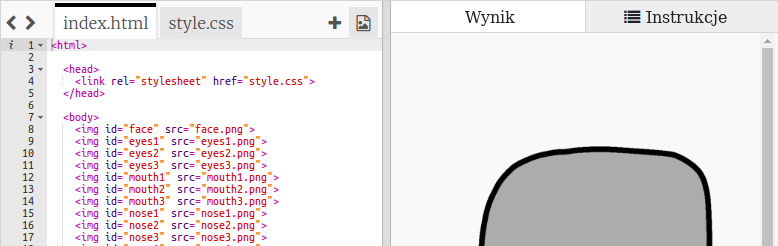

## Dodawanie oczu

Dodajmy robotowi oczy!

+ Otwórz [ten trinket](http://jumpto.cc/web-robot){:target="_blank"}.
    
    Projekt powinien wyglądać następująco:
    
    

Każdy obrazek w projekcie ma swoją nazwę (albo **`id`**). Na przykład kod HTML odwołujący się do grafik twarzy i oczu ('face', 'eyes1' i 'eyes2', zaczynając od linii 8 twojego kodu) wygląda następująco:

    
    
    
    

Możesz użyć `id` grafiki, aby nadać jej własne style, używając CSS i symbolu `#`. To pozwoli ci ostylować każdy obrazek z osobna.

Kliknij na plik `style.css`. Widzisz, że rozmiar grafiki twarzy robota różni się od rozmiarów innych grafik?

+ Dodaj ten kod CSS, aby ostylować oczy robota:
    
        #eyes1 {
        width: 200px;
        }
        

Zauważ, że używając `#eyes1` w swoim kodzie CSS ostylujesz tylko grafikę `eyes1`. Jeżeli wolisz użyć innych oczu, możesz skorzystać z selektorów `#eyes2` albo `#eyes3`!

Widzisz, jak obrazki są wyświetlane jeden po drugim? To nazywa się pozycjonowanie **relatywne (ang. relative)**. Aby poinstruować przeglądarkę, gdzie dokładnie powinny zostać umieszczone oczy robota, trzeba użyć pozycjonowania **absolutnego (and. absolute)**.

+ Dodaj te trzy linie do kodu CSS w odniesieniu do grafiki `eyes1`:
    
        position: absolute;
        top: 200px;
        left: 100px;
        

Zauważ, jak oczy twojego robota przemieściły się w oczekiwane miejsce.

Ten kod CSS mówi przeglądarce, jak daleko od górnego lewego rogu strony wyświetlić obrazek.

Możesz użyć `bottom` (z ang. dół) zamiast `top` (z ang. góra), aby powiedzieć przeglądarce jak daleko od dołu ekranu pokazać grafikę, jak również `right` (a ang. prawa strona) zamiast `left` (z ang. lewa strona), aby pozycjonować ją względem prawej krawędzi.