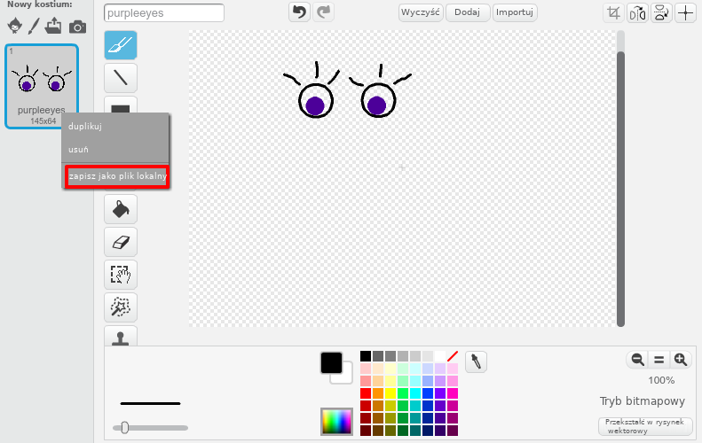

\--- challenge \---

## Wyzwanie: dodaj własne grafiki

Potrafisz stworzyć grafiki i dodać je do twojego robota oraz wypozycjonować na stronie?

+ Jeśli nie posiadasz oprogramowania do rysowania, możesz użyć narzędzi Scratcha do tworzenia **bitmap**, aby narysować nowe części robota. Użyj opcji **zapisz jako plik** aby zapisać kostium jako plik `.png`.
    
    

+ Następnie dodaj plik `.png` do trinketa:
    
    

+ Dodaj grafikę do pliku `index.html`:
    
        
        

+ Następnie dodaj kod pozycjonujący nową część w pliku `style.css`:
    
    

\--- /challenge \---