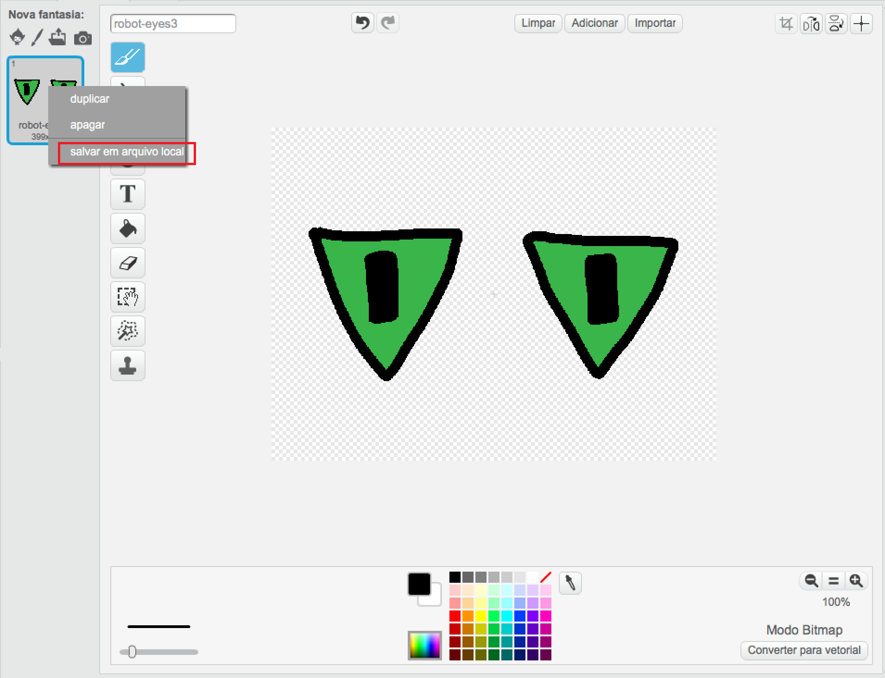

--- challenge ---

## Desafio: Adicione suas próprias imagens

Você pode criar imagens para adicionar ao seu robô e posicioná-las na sua página da Web?

+ Se você não tiver uma ferramenta de software de desenho, você pode usar a ferramenta de desenho Scratch no modo **Bitmap** para desenhar algumas novas peças do robô. Use **salvar em arquivo local** para salvar uma fantasia como uma imagem `.png`.
    
    

+ Então carregue a imagem `.png` em seu trinket:
    
    

+ Adicione a imagem ao `index.html`:
    
        
        

+ E adicione o código CSS ao `style.css` para posicioná-lo:
    
    

--- /challenge ---
