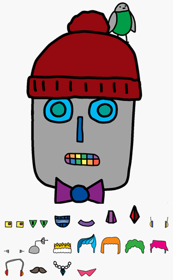

## Introdução

Neste projecto, você vai aprender como se posiciona imagens para criar o seu robô!

### O que você fará

Use CSS para posicionar as partes do robô para criar o seu próprio robô.

### What you will learn

This project covers elements from the following strands of the [Raspberry Pi Digital Making Curriculum](http://rpf.io/curriculum){:target="_blank"}:

+ [Use basic programming constructs to create simple programs](https://www.raspberrypi.org/curriculum/programming/creator){:target="_blank"}

### Additional information for club leaders

If you need to print this project, please use the [printer-friendly version](https://projects.raspberrypi.org/en/projects/build-a-robot/print){:target="_blank"}.

Use the link in the footer to access the GitHub repo for this project, which contains all resources (including an example finished project) in the ‘en/resources’ folder.