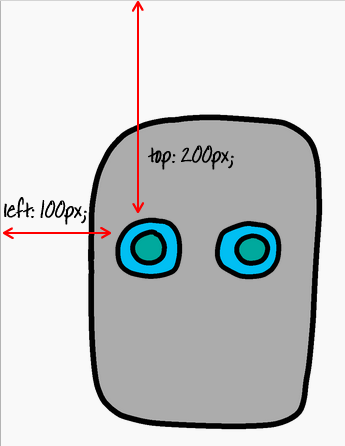

## Dando olhos ao teu robô

Vamos dar olhos ao teu robô!

+ Abre [este trinket](http://jumpto.cc/web-robot){:target="_blank"}.
    
    O projeto deverá parecer-se com isto:
    
    

Cada imagem neste projeto tem o seu próprio nome (ou **`id`**). Por exemplo, o código HTML para endereçar as imagens do rosto e olhos ('face', 'eyes1' e 'eyes2', iniciando na linha 8 do teu código) tem a seguinte aparência:

    
    
    
    

Podes usar o `ID` de uma imagem para lhe dares o seu próprio estilo, usando CSS e o símbolo ` # `. Isso permite que possas estilizar cada imagem separadamente.

Clica no ficheiro ` style.css `. Observas como o tamanho do rosto do robô e as outras imagens são diferentes?

+ Adiciona este código CSS para estilizar os olhos do robô:
    
        # eyes1 {
        width: 200px;
        }
        

Nota que estás a estilar apenas a imagem `eyes1`, ao usar `#eyes1` no teu código CSS. Se preferires olhos diferentes, podes usar ` # eyes2 ` ou ` # eyes3 `!

Notas como cada imagem é exibida uma após a outra? Isto é chamado posicionamento **relativo**. Se quiseres dizer ao navegador exatamente onde colocar os olhos do teu robô, vais precisar de usar posicionamento **absoluto**.

+ Adiciona estas três linhas ao código CSS para a tua imagem `eyes1`:
    
        position: absolute;
        top: 200px;
        left: 100px;
        

Deverás notar que os olhos do teu robô se movem para o local correto.

Este código CSS indica ao navegador a que distância do canto superior esquerdo da página é exibida a imagem.

Podes usar ` bottom ` (inferior) em vez de ` top ` (topo) para indicar ao navegador a que distância da parte inferior do ecrã deverá mostrar a imagem, bem como ` right `(direita) em vez de ` left ` (esquerda).