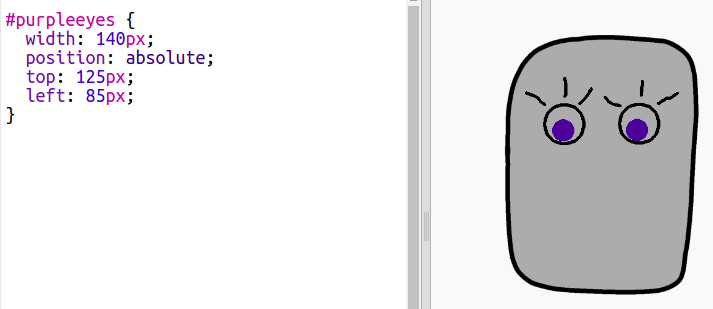

\--- challenge \---

## Desafio: adiciona as tuas imagens

Podes criar imagens para adicionar ao teu robô e posicioná-las na tua página?

Usa qualquer software de desenho que tenhas no teu computador para desenhar algumas novas peças para o robô e guarda-las como uma imagem `.png`.

+ Then upload the `.png` image into your trinket:

+ Add the image to `index.html`: 

    
    

+ And add CSS code to `style.css` to position it:

\--- /challenge \---