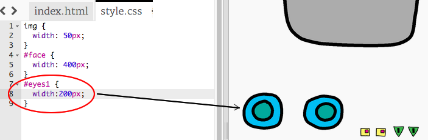

## Pune-i robotului tău, ochii

Haideți sa-inpunem robotului niște ochi!

+ Deschide [this trinket](http://jumpto.cc/web-robot).
    
    Proiectul ar trebui să arate astfel:
    
    

Fiecare imagine din acest proiect are propriul ei nume (or **`id`**). Spre exemplu, codul HTML pentru accesarea imaginilor cu față sau ochi (‘face’, ‘eyes1’, and ‘eyes2’, starting on line 8 of your code) arată astfel:

    
    
    
    

Poți folosi imaginea `id` penttu a creea stilul tău peopriu, folosind CSS și simbolul `#` symbol. Asta îți va permite să modifici fiecare imagine separat.

Apasă pe fișierul `style.css`. Ai observat diferența dintre dimensiunea feței robotului și alte imagini sunt diferite?

+ Adăugați acest cod CSS pentru a modela ochii robotului:
    
        #eyes1 {
        width: 200px;
        }
        

Observi ca modelezi doar imaginea `eyes1`, folosind `#eyes1` în codul tăuin CSS. Dacă preferi alți ochi, folosește în schimb `#eyes2` or `#eyes3`!

Observați cum este afișată fiecare imagine una după alta? This is called **relative** positioning. If you want to tell the browser exactly where to place your robot’s eyes, you’ll need to use **absolute** positioning instead.

+ Add these three lines to the CSS code for your `eyes1` image:
    
        position: absolute;
        top: 200px;
        left: 100px;
        

You should see that your robot’s eyes move to the correct place on your robot.

This CSS code tells the browser how far from the top left-hand corner of the webpage to display the image.

You can use `bottom` instead of `top` to tell the browser how far from the bottom of the screen to show the image, as well as `right` instead of `left`.