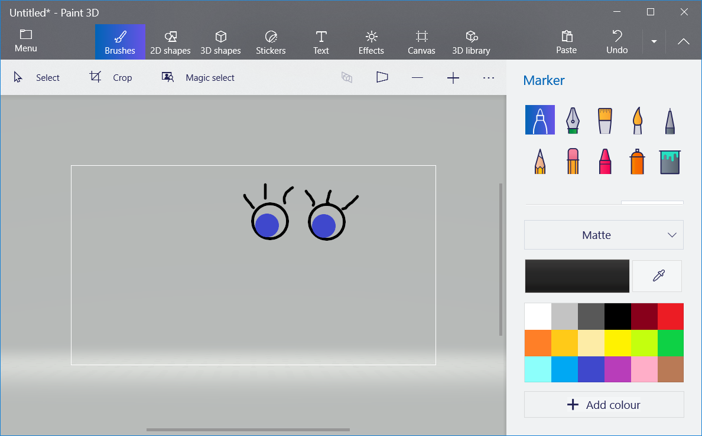

\--- challenge \---

## Provocare: adaugă propriile tale imagini

Poți să creezi imagini pe care să le adaugi robotului tău, și să le poziționezi în pagina web?

Folosește oricare program de desenare pe care îl ai pe calculatorul tău pentru a desena părți noi pentru robotul tău, și salvează-le ca fișier `.png`.

+ Apoi încarcă imaginea `.png` în trinket:

+ Adaugă imaginea la `index.html`: 

    
    

+ Adaugă și codul CSS la `style.css` pentru a o poziționa:

\--- /challenge \---