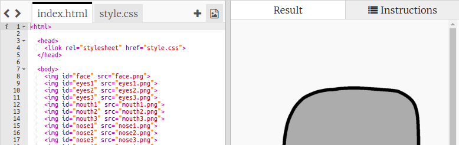
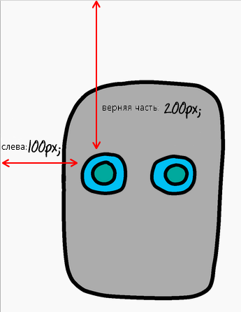

## Задать роботу глаза

Давай дадим твоему роботу глаза!

+ Открой [этот trinket](http://jumpto.cc/web-robot){:target="_blank"}.
    
    Проект должен выглядеть следующим образом:
    
    

Каждое изображение в этом проекте имеет свое имя или **`id`** (идентификатор). Например, HTML-код для использования изображений лица и глаз ['face' (лицо на англ.), 'eyes1' (глаза1 на англ.) и 'eyes2', начиная со строки 8 вашего кода] выглядит следующим образом:

    
    
    
    

Ты можешь использовать `id` изображения для того, чтобы задать его собственный стиль, используя CSS и символ `#`. Это позволит тебе стилизовать каждое изображение отдельно.

Нажми на файл `style.css`. Заметь, как различаются размеры лица робота и другие изображения.

+ Добавь этот CSS-код для стилизации глаз робота:
    
        #eyes1 {
        width: 200px;
        }
        

Обратите внимание, что ты стилизуешь только изображение `eyes1`, используя `#eyes1` в твоём CSS-коде. Если тебе не нравятся эти глаза, ты можешь использовать вместо них `#eyes2` или `#eyes3`!

Обрати внимание, как каждое изображение отображается одно за другим. Это называется **относительным** позиционированием. Если ты хочешь указать браузеру точные координаты для размещения глаз твоего робота, тебе нужно использовать **абсолютное** позиционирование.

+ Добавь эти три строки в CSS-код для твоего изображения `eyes1`:
    
        position: absolute;
        top: 200px;
        left: 100px;
        

Ты должен увидеть, что глаза твоего робота будут перемещены в правильное место на нём.

Этот CSS-код сообщает браузеру, как далеко от верхнего левого угла веб-страницы располагается изображение.

Ты можешь использовать `bottom` (дно) вместо `top` (вершина), чтобы сообщить браузеру, как далеко от нижней части экрана показывать изображение, а также `right` вместо `left`.