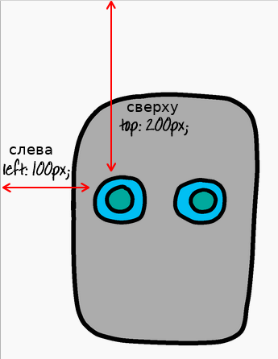

## Задать роботу глаза

Давай дадим твоему роботу глаза!

+ Открой [этот trinket](http://jumpto.cc/web-robot){:target="_blank"}.
    
    Проект должен выглядеть следующим образом:
    
    

Каждое изображение в этом проекте имеет свое имя или **`id`** (идентификатор). Например, HTML-код для использования изображений лица и глаз ['face' (лицо на англ.), 'eyes1' (глаза1 на англ.) и 'eyes2', начиная со строки 8 вашего кода] выглядит следующим образом:

    
    
    
    

Ты можешь использовать `id` изображения для того, чтобы задать его собственный стиль, используя CSS и символ `#`. Это позволит тебе стилизировать каждое изображение отдельно.

Click on the `style.css` file. Notice how the size of the robot’s face and the other images are different?

+ Add this CSS code to style the robot’s eyes:
    
        #eyes1 {
        width: 200px;
        }
        

Notice that you’re styling just the `eyes1` image, by using `#eyes1` in your CSS code. If you prefer different eyes, you can use `#eyes2` or `#eyes3` instead!

Notice how each image is displayed one after the other? This is called **relative** positioning. If you want to tell the browser exactly where to place your robot’s eyes, you’ll need to use **absolute** positioning instead.

+ Add these three lines to the CSS code for your `eyes1` image:
    
        position: absolute;
        top: 200px;
        left: 100px;
        

You should see that your robot’s eyes move to the correct place on your robot.

This CSS code tells the browser how far from the top left-hand corner of the webpage to display the image.

You can use `bottom` instead of `top` to tell the browser how far from the bottom of the screen to show the image, as well as `right` instead of `left`.