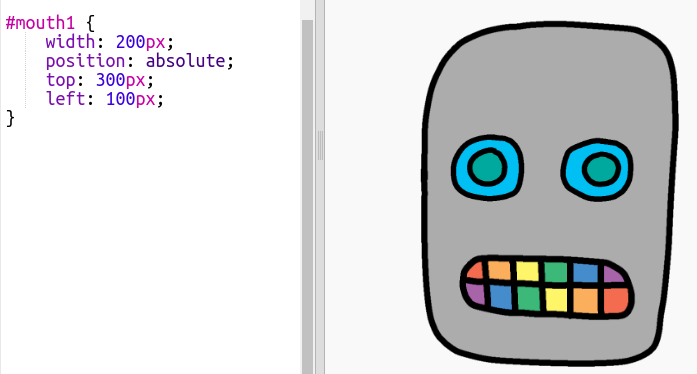

## Задать роботу рот

Давай дадим твоему роботу рот!

- Добавь следующий CSS-код в нижнюю часть `style.css`, чтобы стилизовать своё изображение `mouth1`:
```    
        #mouth1 {
            width: 50px;
            position: absolute;
            top: 200px;
            left: 200px;
        }
```        

Рот твоего робота выглядит совсем маленьким, к тому же он не в том месте!


- Можешь ли ты исправить это, внеся изменения в свой CSS-код?

--- hints ---

--- hint ---

Тебе нужно будет изменить `width` и позиции `top` и `left` для `mouth1` в файле `style.css`.

Попробуй разные значения, пока все не будет выглядеть так, как ты бы хотел.

--- /hint ---

--- hint ---

У тебя должно получиться что-то вроде этого:



--- /hint ---

--- /hints ---