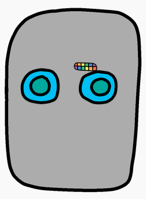

## Дайте Вашому роботу рот

Давайте дамо Вашому роботу рот!

- Додайте наступний код CSS у нижній частині `style.css`, щоб створити своє зображення `mouth1`:
    
        #mouth1 {
            width: 50px;
            position: absolute;
            top: 200px;
            left: 200px;
        }
        

Рот вашого робота виглядає досить малим, і він не в правильному місці!

- Ви можете це виправити, внісши зміни до вашого CSS-коду?

\--- hints \---

\--- hint \---

You'll need to change the `width` and the `top` and `left` positions for `mouth1` in `style.css`.

Try different values until it looks the way you want.

\--- /hint \---

\--- hint \---

You should have something like this:

\--- /hint \---

\--- /hints \---