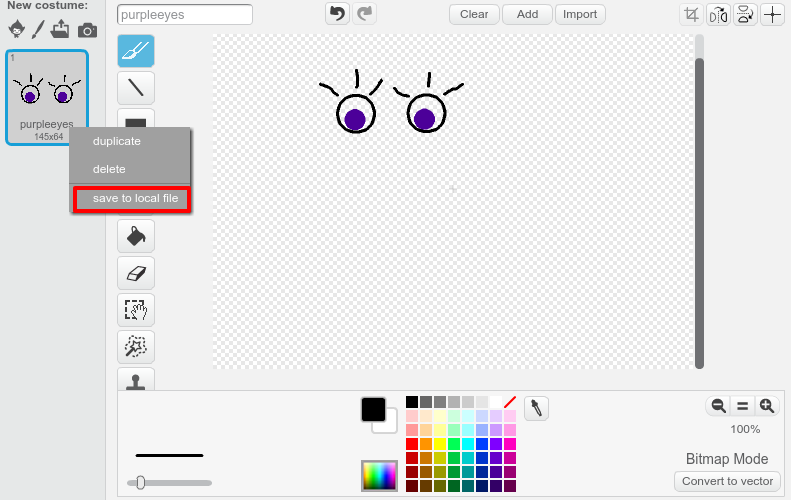

-- challenge ---

## Завдання: додайте ваші власні зображення

Чи можете ви створити зображення, щоб додати їх до свого робота, і розмістити на своїй веб-сторінці?

+ Якщо у вас немає software для малювання, ви можете використати Scratch в режимі **Bitmap**, щоб намалювати деякі нові частини робота. Використовуйте **save as local file**, щоб зберегти костюм як `.png`.
 
    
    </li> 
    
    + Потім завантажте зображення `.png`:
        
        
    
    + Додайте зображення до `index.html`:
        
            
            
    
    + І додати CSS-код в `style.css`, щоб помістити його:
        
        </ul> 
    
    --- /challenge ---