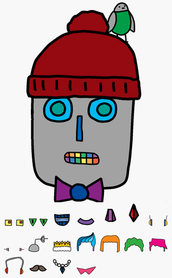

## 介绍

你将在本项目中学习如何放置图片来创建你自己的机器人！



### 更多俱乐部领导参考信息

如果你需要打印本项目，请使用 [适合打印机的版本](https://projects.raspberrypi.org/en/projects/build-a-robot/print)。


--- collapse ---
---
title: 俱乐部领导备注
---


## 介绍：
孩子们将在本项目中通过制作自己的机器人来学习 CSS 定位相关的知识。

## 在线资源

我们推荐使用 [trinket](https://trinket.io/) 来在线编写 HTML & CSS。本项目包含以下 trinket：

+ [‘制作一个机器人’起点 -- jumpto.cc/web-robot](http://jumpto.cc/web-robot)

孩子们也可使用该空白 trinket [(jumpto.cc/html-blank)](http://jumpto.cc/html-blank) 来编写自己的 HTML & CSS，或者他们可以使用该 trinket 模板 [(jumpto.cc/html-template)](http://jumpto.cc/html-template)。

还有一个 trinket，其中包含相关挑战的解决方案样例：

+ [‘制作一个机器人’已完成 -- trinket.io/html/00736c0e18](https://trinket.io/html/00736c0e18)

## 离线资源
如果愿意的话，本项目可[离线完成](https://www.codeclubprojects.org/en-GB/resources/webdev-working-offline/)。你可以通过单击此项目的“项目材料”链接来访问项目资源。此链接包含一个“项目资源”部分，其中包括孩子们离线完成本项目时所需的资源。确保每个孩子都能访问这些资源的副本。本节包括以下文件：

+ template/index.html
+ template/style.css
+ robot/index.html
+ robot/style.css
+ 大量 .png 图片

你还可以在“志愿者资源”部分中找到本项目挑战的完整版本，其中包含：

+ robot-finished/index.html
+ robot-finished/style.css
+ robot-finished/ 大量 .png 图片

（以上所有的资源也可以作为项目和志愿者 `.zip` 文件下载。）

## 学习目标
+ HTML id 属性；
+ 编写 CSS：
	+ `#` id 选择器；
	+ 定位；
	+ 顶部；
	+ 左侧。

本项目包括 [Raspberry Pi 数字制作课程](https://rpf.io/curriculum) 以下几个部分的元素：

+ [设计基本的 2D 和 3D 资源](https://www.raspberrypi.org/curriculum/design/creator)。

## 挑战
+ “设计你自己的机器人”- 应用 CSS 定位来创建一个机器人；
+ “添加你自己的图片”- 使用 HTML id 属性和相关的 CSS 添加更多图片。

## 离线完成此项目
如果孩子们要离线完成此项目，他们将需要把他们打算使用的图片保存在 `Robot.html` 文件所在的文件夹中。

他们随后可以将文件名添加进他们的 `` 标记中：

```

```

--- /collapse ---


--- collapse ---
---
title: 项目材料
---
## 项目资源
* [包含所有项目资源的.zip 文件](resources/robot-project-resources.zip)
* [包含所有“制作一个机器人”项目资源的在线 Trinket](http://jumpto.cc/web-robot)
* [在线 Trinket 模板](http://jumpto.cc/trinket-template)
* [在线空白 Trinket](http://jumpto.cc/trinket-blank)
* [template/index.html](resources/template-index.html)
* [template/style.css](resources/template-style.css)
* [robot/index.html](resources/robot-index.html)
* [robot/style.css](resources/robot-style.css)
* [robot/antenna.png](resources/robot-antenna.png)
* [robot/bird.png](resources/robot-bird.png)
* [robot/bowtie.png](resources/robot-bowtie.png)
* [robot/crown.png](resources/robot-crown.png)
* [robot/ears1.png](resources/robot-ears1.png)
* [robot/ears2.png](resources/robot-ears2.png)
* [robot/eyes1.png](resources/robot-eyes1.png)
* [robot/eyes2.png](resources/robot-eyes2.png)
* [robot/eyes3.png](resources/robot-eyes3.png)
* [robot/face.png](resources/robot-face.png)
* [robot/hair1.png](resources/robot-hair1.png)
* [robot/hair2.png](resources/robot-hair2.png)
* [robot/hair3.png](resources/robot-hair3.png)
* [robot/hair4.png](resources/robot-hair4.png)
* [robot/hat.png](resources/robot-hat.png)
* [robot/headphones.png](resources/robot-headphones.png)
* [robot/moustache.png](resources/robot-moustache.png)
* [robot/mouth1.png](resources/robot-mouth1.png)
* [robot/mouth2.png](resources/robot-mouth2.png)
* [robot/mouth3.png](resources/robot-mouth3.png)
* [robot/necklace.png](resources/robot-necklace.png)
* [robot/nose1.png](resources/robot-nose1.png)
* [robot/nose2.png](resources/robot-nose2.png)
* [robot/nose3.png](resources/robot-nose3.png)
* [robot/sunglasses.png](resources/robot-sunglasses.png)

## 俱乐部领导资源
* [包含所有已完成项目资源的 .zip 文件](resources/robot-volunteer-resources.zip)
* [在线完整 Trinket 项目](https://trinket.io/html/00736c0e18)
* [robot-finished/index.html](resources/robot-finished-index.html)
* [robot-finished/style.css](resources/robot-finished-style.css)
* [robot-finished/antenna.png](resources/robot-finished-antenna.png)
* [robot-finished/bird.png](resources/robot-finished-bird.png)
* [robot-finished/bowtie.png](resources/robot-finished-bowtie.png)
* [robot-finished/crown.png](resources/robot-finished-crown.png)
* [robot-finished/ears1.png](resources/robot-finished-ears1.png)
* [robot-finished/ears2.png](resources/robot-finished-ears2.png)
* [robot-finished/eyes1.png](resources/robot-finished-eyes1.png)
* [robot-finished/eyes2.png](resources/robot-finished-eyes2.png)
* [robot-finished/eyes3.png](resources/robot-finished-eyes3.png)
* [robot-finished/face.png](resources/robot-finished-face.png)
* [robot-finished/hair1.png](resources/robot-finished-hair1.png)
* [robot-finished/hair2.png](resources/robot-finished-hair2.png)
* [robot-finished/hair3.png](resources/robot-finished-hair3.png)
* [robot-finished/hair4.png](resources/robot-finished-hair4.png)
* [robot-finished/hat.png](resources/robot-finished-hat.png)
* [robot-finished/headphones.png](resources/robot-finished-headphones.png)
* [robot-finished/moustache.png](resources/robot-finished-moustache.png)
* [robot-finished/mouth1.png](resources/robot-finished-mouth1.png)
* [robot-finished/mouth2.png](resources/robot-finished-mouth2.png)
* [robot-finished/mouth3.png](resources/robot-finished-mouth3.png)
* [robot-finished/necklace.png](resources/robot-finished-necklace.png)
* [robot-finished/nose1.png](resources/robot-finished-nose1.png)
* [robot-finished/nose2.png](resources/robot-finished-nose2.png)
* [robot-finished/nose3.png](resources/robot-finished-nose3.png)
* [robot-finished/sunglasses.png](resources/robot-finished-sunglasses.png)

--- /collapse ---