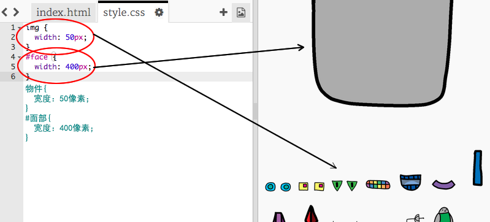
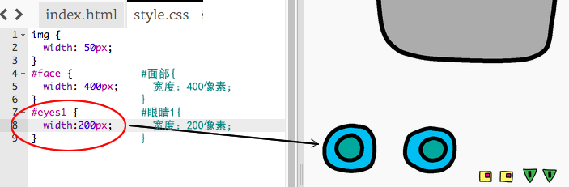
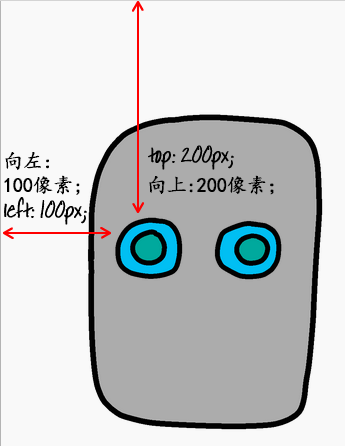

## 给你的机器人装上眼睛

让我们来给你的机器人装上眼睛！

+ 打开 [这个trinket](http://jumpto.cc/web-robot){:target="_blank"}.
    
    效果应该是这样：
    
    

此项目中每张图像都有它自己的名称（或**`ID`**） 例如，代表面部和眼睛图像的HTML代码（从代码的第8行开始的“face”，“eyes1”和“eyes2”）如下所示：

    
    
    
    

你可以使用CSS和`#`符号来为图像设计出你自己的风格`ID`。你可以单独设计每个图像的样式。

点击该文件`style.css`。注意到机器人脸部的大小和其它图像的大小有什么不同吗？

+ 添加这行CSS代码来设计机器人的眼睛：
    
        #eyes1 {
        width：200px; 
        }
        

请注意，这行CSS代码中使用`#eyes1`只有改到 `eyes1`图片的样式哦。 如果你更喜欢让机器人拥有不同的双眼，你可以用`#eyes2`或`#eyes3`代替！

注意到每张图像是如何显示的吗？ 这叫做**相对**定位。 如果你想让浏览器将机器人的眼睛明确地放在某处，你就需要使用**绝对**定位。

+ 把这三行程式添加到你的`eyes1`图像代码中
    
        position: absolute;
        top: 200px;
        left: 100px;
        

你应该会看到机器人的眼睛移动到了脸上的正确位置。

这三行CSS代码告诉浏览器该图像应该距离网页左上角多远。

您也可以使用`bottom`而不是`top`来告诉浏览器从屏幕底部算起多远以显示图像，以及从屏幕的右侧算起`right`而不只是从左侧`left`。