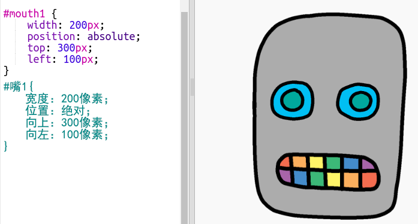

## 给你的机器人装上嘴巴

让我们来给你的机器人装上嘴巴！

- 将下列CSS编码添加到`style.css`底部来创造你的机器人`嘴巴`图像:
    
        #嘴巴1 {
            width: 50px;
            position: absolute;
            top: 200px;
            left: 200px;
        }
        

你的机器人的嘴巴看起来很小，并且它不在正确的位置！

- 你能通过更改CSS代码来解决这个问题吗？

\--- hints \--- \--- hint \--- 你需要改变`style.css`中机器人`嘴巴`的`宽度`及其距`上端`及`左侧`的位置.

尝试不同数值知道它看起来是你想要的那样 \--- /hint \--- \--- hint \--- 你可以这样进行调整:

 \--- /hint \--- \--- /hints \---