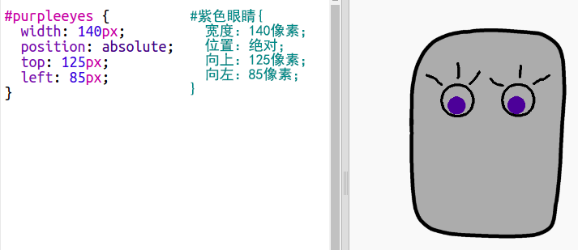

\--- challenge \---

## 挑战：添加你自己的图片

您可以创建图片将其添加到你得机器人上，并将它们放在您的网页上吗？

使用您电脑上的任何一款绘图软件来绘制一些新的机器人零件，并保存为`.png`格式的图片。

+ 然后上传`.png`格式的图片到您的trinket中：

+ 将图片添加至`index.html`文件中： 

    
    

+ 并且将CSS代码添加至`style.css`中将机器人放入你设定的位置上:

\--- /challenge \---