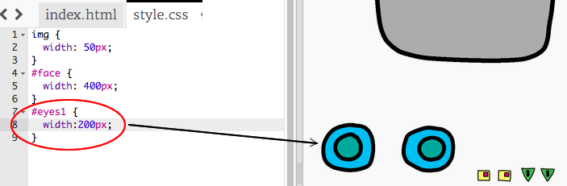

## 給機器人裝上眼睛

讓我們來給你的機器人裝上一些眼睛吧！

+ Open [this trinket](http://jumpto.cc/web-robot){:target="_blank"}.
    
    檔案應該像這樣︰
    
    

在此項目中的每個圖像都有他們自己的名字（或 **`id`**）。 例如，代表臉和眼睛圖像的HTML代碼（從程式的第8行開始找'face'，'eyes1'和'eyes2'）會是像以下所顯示的：

    
    
    
    

您可以使用CSS和 `＃` 符號來為圖像的設計出你自己的風格 `ID` 。您可以單獨設計每個圖像的樣式。

點開這個檔案 `style.css` 。注意到機器人臉部的大小和其他圖像的大小有什麼不同嗎？

+ 加入這行CSS代碼來設計機器人的眼睛：
    
        ＃eyes1 {width：200px; }
        

請注意，這行CSS代碼中使用 `＃eyes1` 只有改到 `eyes1` 圖片的樣式喔。 如果你喜歡機器人有不同的眼睛，你可以使用 `＃eyes2` 或 `＃eyes3` 來代替！

注意到每個圖像是如何依照程式的順序來顯示的嗎？ 這叫做 **相對** 定位。 如果您想告訴瀏覽器明確地將機器人的眼睛放在某處，就得使用 **絕對** 定位。

+ 將這三行程式加到您的 `eyes1` 圖像的CSS代碼中：
    
        position: absolute;
        top: 200px;
        left: 100px;
        

你應該會看到你的機器人眼睛移動到機器人的臉上正確位置。

這三行CSS代碼告訴瀏覽器從網頁左上角算起要離多遠以顯示圖像。

您也可以使用 `bottom` 而不是 `top` 來告訴瀏覽器從螢幕底部算起多遠以顯示圖像，以及 從螢幕的右側算起`right`而不是左側 `left`。